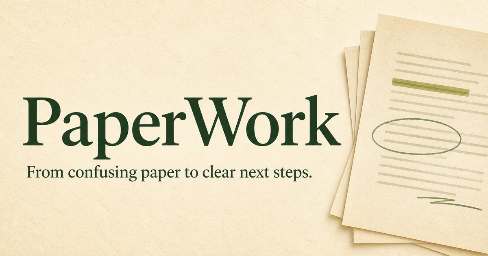

# PaperWork

> Turn an offer-letter PDF into clear next steps—with evidence for every important claim.

[](LICENSE)
[](ROADMAP.md)
[](CONTRIBUTING.md)



PaperWork is an open-source workspace for understanding consequential paperwork. It is being designed to show four things clearly: what the source says, what PaperWork inferred, what it recommends, and where the user's data went.

## Project status

**PaperWork v0.1 now performs a narrow, real browser-local analysis.** It accepts
PDF offer letters with selectable English text, extracts every page using a
same-origin bundled PDF worker, creates immutable page-region segments, detects
explicit offer terms with deterministic rules, and renders a plan only after
citations, claim semantics, action safety, the event ledger, and the strict
Action Pack contract all pass.

It does not use an AI provider, upload document content to a PaperWork server,
perform OCR, accept links/images/DOCX, or claim to analyze arbitrary document
types. Scans, password-protected PDFs, partial extraction, overprinted or
non-monotonic text ordering, and unsupported offer wording are
safely withheld instead of producing a guess. This is an early milestone, not
professional employment or legal advice.

## What PaperWork will give users

| User question | PaperWork output |
| --- | --- |
| What is this? | A plain-language document identity and purpose |
| Do I need to act? | Urgency, obligations, deadlines, and unresolved items |
| What should I do first? | A prioritized, checkable action plan |
| What proves it? | An exact cited passage or image region for each important claim |
| What is uncertain? | Explicit inference, suggestion, conflict, and unconfirmed labels |
| Where did my data go? | A human-readable processing receipt and technical event log |

## Try it locally

Requirements: Node.js 22.13 or later. Browser analysis requires a current
evergreen browser with module workers, Web Crypto, `structuredClone`, and
`Promise.withResolvers`; PaperWork reports the local extractor as unavailable
before reading file bytes when those capabilities are missing.

```bash
git clone https://github.com/anshhu-man/paperwork.git
cd paperwork
npm install
npm run dev
```

Open [http://localhost:3000](http://localhost:3000), choose **Analyze the
synthetic sample**, approve both local operations, and inspect its observed run
receipt. You can then try a compatible PDF. Review the threat model before
using a genuinely sensitive document; browser extensions, the device, and the
host that serves application assets remain outside PaperWork's code boundary.

## Non-negotiable product rules

- No important claim without exact evidence.
- Keep source facts separate from inferences and suggested actions.
- Say **Not confirmed** when the supplied sources are insufficient.
- Show the complete data flow before any external transmission.
- Do not store documents by default.
- Never present an AI interpretation as professional legal, medical, or financial advice.

## Architecture and trust

The application uses React, TypeScript, Vinext, and an exact-pinned
`pdfjs-dist` browser worker. It has no database, account system, telemetry,
object storage, document-processing backend, or AI API call.

The only renderable domain object is `TrustedActionPackV1`. The public live
entry point accepts a browser `File`; no public operation can mark an imported
pack, model draft, receipt, or self-attested JSON object as trusted. A private
WeakSet registers only the final deep-frozen clone after PaperWork independently
rechecks canonical evidence spans, deterministic claim templates, normalized
dates and money, conflict alternatives, allowlisted manual actions, the
six-event local ledger (two local authorizations, source admission, extraction,
analysis, and validation), and the strict runtime contract. Authorization is
fresh, ordered, bound to a one-use run UUID, and recorded before file reading.
Serialization,
spreading, or cloning removes that identity-based trust.

Read the contributor-facing [architecture](docs/ARCHITECTURE.md) and [privacy threat model](docs/PRIVACY-THREAT-MODEL.md) before changing the processing boundary. The [roadmap](ROADMAP.md) defines the gates for the first useful release.

## Help build it

Useful next contributions include accessibility reviews, adversarial PDF
fixtures, browser network-isolation tests, safe OCR with source coordinates,
citation evaluation, privacy analysis, translations, and additional narrow
offer-letter layouts.

- Start with an issue labeled [`good first issue`](https://github.com/anshhu-man/paperwork/labels/good%20first%20issue).
- Propose a document type with the structured issue form.
- Use [Discussions](https://github.com/anshhu-man/paperwork/discussions) for questions and early ideas.
- Read [CONTRIBUTING.md](CONTRIBUTING.md), the [code of conduct](CODE_OF_CONDUCT.md), and [SECURITY.md](SECURITY.md) before contributing.

The prepared [launch kit](docs/LAUNCH-KIT.md) contains faceless demo and community-post templates. Public promotion is intentionally gated on a genuinely usable hosted build.

## License

PaperWork is available under the [MIT License](LICENSE).
